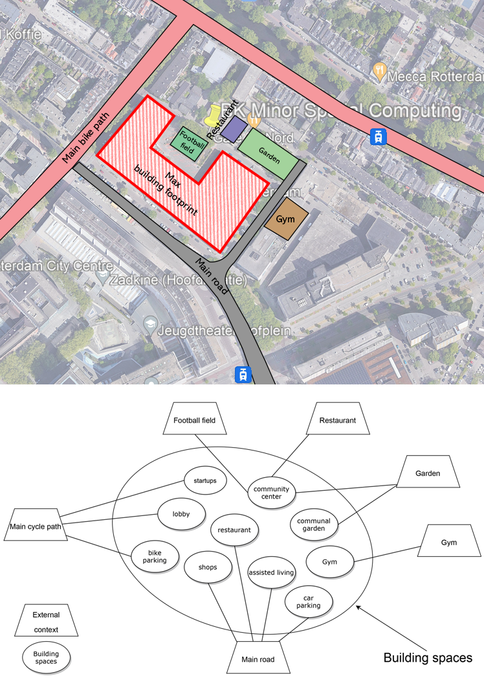

# Product of Planning

### Metro Diagram

**Metro diagram**: The connection between all spaces is layed out and colored with the different users in mind; Residents with student (orange), starters (green) assisted living (blue) and Externals (purple) containing those who work at the startups, clients of the startups, visitors of the residents, and those who provide services to the building. 

### Exterior Context Relationships ###

**Exterior context relationships**: The building is in the city and the spaces within it have a relationship with the spaces without.

