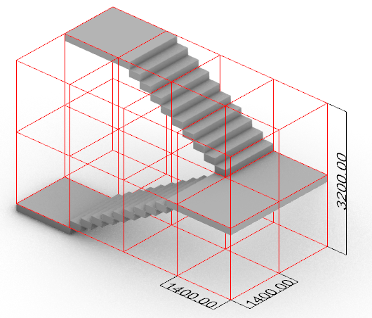
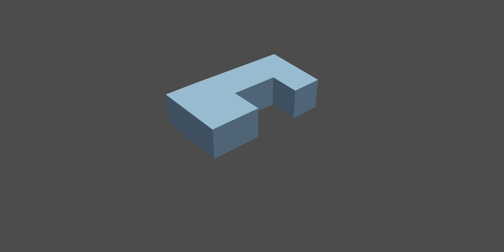
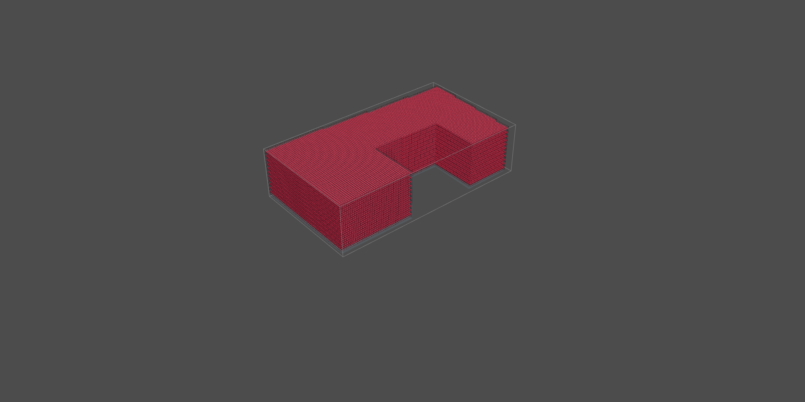
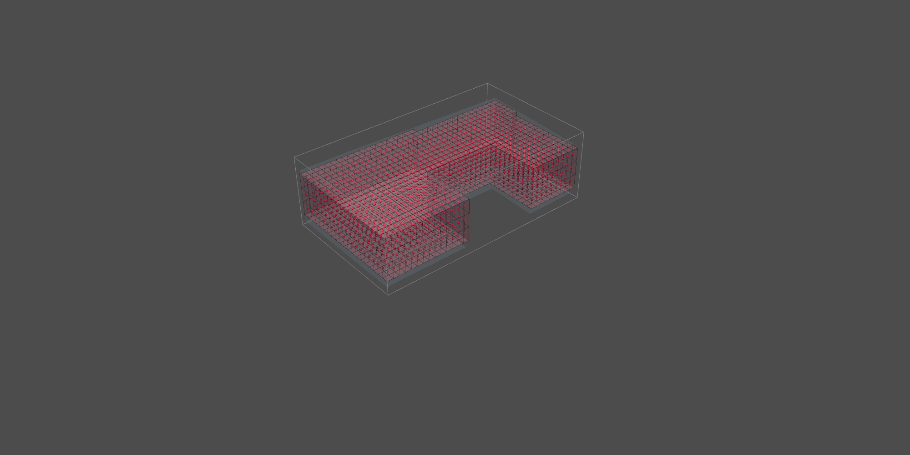

# Process of configuring

The second part of the process is the configuring. This pertains specifically to the goals set during the first phase of A1. 

## Space criteria

The municipal plan of Rotterdam as shown in A1 embodies the design goals that were set out during the initial phase. These design goals have been quantified in the following charts.

### Connectiveness Chart

The connectiveness chart shows the connection between agents and spaces and has been made through the metro diagram previously shown in A1_planning.

<iframe src="https://docs.google.com/spreadsheets/d/1rvnkMuqiWgCPXm_N5H8aBM5d_srQSfDutk2AlIN4zD0/edit#gid=0" style="width:150%; height:600px;" frameborder="0">
</iframe>
*Connectiveness chart*

### Relative Prefrences Chart

based on the connectiveness chart the relative prefrences chart was made by assigning a level of importance (between 0 and 1) for each connection. 

<iframe src="https://docs.google.com/spreadsheets/d/1rvnkMuqiWgCPXm_N5H8aBM5d_srQSfDutk2AlIN4zD0/edit?usp=sharing" style="width:150%; height:600px;" frameborder="0">
</iframe>
*Relative prefrences chart*

### Space Requirement Chart

The building is formed by the agents and each agent has it's own set of requirements based on the service it provides to the users. The space requirements where partly based on 

<iframe src="https://docs.google.com/spreadsheets/d/1bQiBhYUO5N8wir9nw1VwhP7LahvSmtPdcyQSV35pvKI/edit?usp=sharing" style="width:150%; height:600px;" frameborder="0">
</iframe>
*Space Requirement Chart*

## Matrix of relations

<iframe src="https://viewer.diagrams.net/?tags=%7B%7D&highlight=0000ff&edit=_blank&layers=1&nav=1&title=Connectiongraph.drawio#Uhttps%3A%2F%2Fraw.githubusercontent.com%2FDemnity%2Fspatial_computing%2Fmaster%2Fwebpage%2Fdocs%2Fpdf%2FConnectiongraph.drawio" style="width:150%; height:700px;" frameborder="0">
</iframe>

*Adjacancy and Importance of Relationship charts*

## flowchart

The third aspect of the configuring phase was the creation of a flowchart that encompasses the full project. The flowchart was made partly to give insight in the project at large, as well as set an expectation of certain types of data and the scope of the project. 

<iframe src="https://viewer.diagrams.net/?tags=%7B%7D&highlight=0000ff&edit=_blank&layers=1&nav=1&title=Dataflow.drawio#Uhttps%3A%2F%2Fraw.githubusercontent.com%2FDemnity%2Fspatial_computing%2Fmaster%2Fwebpage%2Fdocs%2Fpdf%2FDataflow.drawio" style="width:150%; height:700px;" frameborder="0">
</iframe>
*Flowchart*

## Determining voxelsize

The configuring phase was also the moment to design voxel size. The starting point is to look at the Dutch building code guidelines. Because of the goal of an inclusive city people using wheel chairs should have full range of the entire building as such te minimum corridor width as stated in "Menselijke maat" should be 90 cm. That was applied to the width of the corridor.

The stairways were used to define the height. the final voxelsize was divided between a high resolution of 1.4 by 1.4 by 3.2. and a lower resolution which corresponds with 27 times the size of the high res voxel at 4.2 by 4.2 by 9.6. more about vocel size in [A4 Forming](https://demnity.github.io/spatial_computing/a4_forming/a4_forming_proces/).

*stairway*

## Voxelizing the lattice

The final part of the configuring process is using the determined voxelsize to to create two lattices based on the compulsory envelope.

*compulsory envelope*

The high resolution lattice will mainly be used for general field creation and polygonization in A3 and A4. 
the low resolution lattice was created with the intent of lowering the calculation impact of more intens calculation wise notebooks this aspect is further discussed in A3. After the caculations the results will be interpolated with the intent of creating comparable lattices with the high resolution. 

*voxelized envelope highres*

*voxelized envelope lowress*

