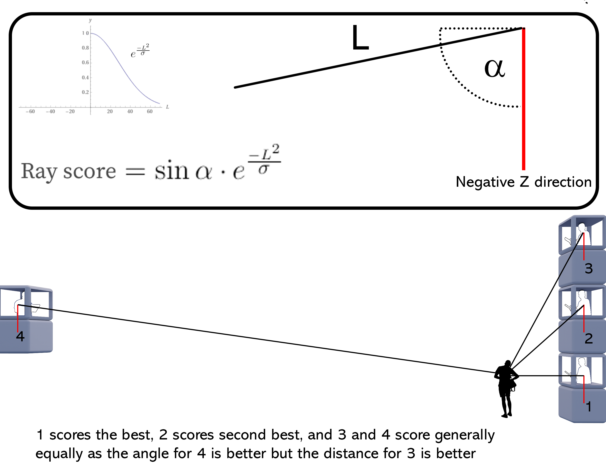

# Process

In A2 Configuration we have established the meaningful desired relationships and preference that serve as the instructions for putting the building together. In Massing this information gets merged together with different methodologies for facilitating said relationships and preference. The method used in this minor is agent based modelling. The term agent has been used in A2 configuration. Agent based modeling uses “agents” that represent a particular function of the building, in our case we have 19 agents, these agents then grow based on predetermined specifications (A2 Configuration) and local changes into something usable, or at least that is the attempt  in our case (see reflections for more). The first step in massing is creating data fields that store values corresponding to preferences, these fields allow for the local changes to be meaningful in terms of our preference. The next step is implementing behaviors for the agents to use when they grow, to help dictate how they treat their own occupied voxels and other agent occupied voxels. At the end of Massing we discuss a dynamic field Street Sight.

## Fields

### Voxelization

The first field was the creation of the voxels based on envelope and the voxelsize determined in [A2 Configuring](https://demnity.github.io/spatial_computing/a2_process/). The corresponding flowchart shows that the field starts with compulsory envelope. As stated before in the configuring two voxel lattices have been constructed with both the high and low resoltion.

### Street Distance

The second field is the calculation of street distance. The input of which is the voxelized envelope. It then creates and calculates points 

### Street Point Creation

The third field is the street point creation.

<table><thead><tr class="header"><th>Street Point Creation</th><th></th></tr></thead><tbody><tr class="odd"><td>Input</td><td>streetpoint, compulsory envelope, immediate context and voxelized Envelope</td></tr><tr class="even"><td>Output</td><td>
Street Point Creation field
</td></tr>
<tr class="odd"><td>Code</td><td>
<pre>
1 > Create street points (from previous slide)

2 > Find voxels closest to the street points (normally the ground façade voxels)

3 > Set those voxel values to 0 and the rest to infinity

4 > Use breath first search traversal to find the distance of the rest of the voxels to the voxels closest to the street points
</pre>
</td></tr></tbody></table>

### Football Field Distance

The fourth field is the football field distance.

<table><thead><tr class="header"><th>Pseudocode</th><th></th></tr></thead><tbody><tr class="odd"><td>Input</td><td></td>streetpoint, compulsory envelope, immediate context and voxelized Envelope</tr><tr class="even"><td>Output</td><td>
Football Field Distance field
</td></tr>
<tr class="odd"><td>Code</td><td>
<pre>
1 > Create football field points

2 > Use the same idea as in street distance

3 > Normalize
</pre>
</td></tr></tbody></table>

### Loudness/ Noise

The fifth field is the loudness.

<table><thead><tr class="header"><th>Pseudocode</th><th></th></tr></thead><tbody><tr class="odd"><td>Input</td><td>streetpoint, compulsory envelope, immediate context and voxelized Envelope</td></tr><tr class="even"><td>Output</td><td>
Loudness/ Noise field
</td></tr>
<tr class="odd"><td>Code</td><td>
<pre>
1 > Create street points (from previous slide)

2 > Create football field noise

3 > Calculate the distance from each voxel to every noise points

4 > Normalize
</pre>
</td></tr></tbody></table>

### Penthouse Factor

The sixth field is the penthouse factor.

<table><thead><tr class="header"><th>Pseudocode</th><th></th></tr></thead><tbody><tr class="odd"><td>Input</td><td>streetpoint, compulsory envelope, immediate context and voxelized Envelope</td></tr><tr class="even"><td>Output</td><td>
Penthouse Factor field
</td></tr>
<tr class="odd"><td>Code</td><td>
<pre>
1 > Extract each voxel centroids in the form of (x, y, z)

2 > Set the voxel values to their corresponding z values

3 > Normalize
</pre>
</td></tr></tbody></table>

### Sun access

The seventh field is the sun access.

<table><thead><tr class="header"><th>Pseudocode</th><th></th></tr></thead><tbody><tr class="odd"><td>Input</td><td>streetpoint, compulsory envelope, immediate context and voxelized Envelope</td></tr><tr class="even"><td>Output</td><td>
Sun access field
</td></tr>
<tr class="odd"><td>Code</td><td>
<pre>
1 > Find out sun directions every 90 days 

2 > Accumulate the sun directions

3 > Do an intersection test from each voxel in the direction of the sun

4 > Use the result of the intersection to calculate the percentage of rays not hitting the context mesh (getting the rays that can see the sun)

5 > Store the percentages as field values
</pre>
</td></tr></tbody></table>

### Shadow blocking

The eight field is the shadow blocking.

<table><thead><tr class="header"><th>Pseudocode</th><th></th></tr></thead><tbody><tr class="odd"><td>Input</td><td>streetpoint, compulsory envelope, immediate context and voxelized Envelope</td></tr><tr class="even"><td>Output</td><td>
Shadow blocking field
</td></tr>
<tr class="odd"><td>Code</td><td>
<pre>
1 > Find out sun directions every 90 days 

2 > Accumulate the sun directions

3 > Do an intersection test from each voxel in the inverse direction of the sun

4 > Use the result of the intersection to calculate the percentage of rays not hitting the context mesh (getting the rays that can see the sun)

5 > Store the percentages as field values
</pre>
</td></tr></tbody></table>

### Shadowing

The ninth field is the shadowing.

<table><thead><tr class="header"><th>Pseudocode</th><th></th></tr></thead><tbody><tr class="odd"><td>Input</td><td>streetpoint, compulsory envelope, immediate context and voxelized Envelope</td></tr><tr class="even"><td>Output</td><td>
Usable lattice
</td></tr>
<tr class="odd"><td>Code</td><td>
<pre>
1 > Import shadowing field calculated before as a lattice

2 > Define a threshold

3 > If shadow value > threshold: 
         Set voxel to False
     Else: 
         Set voxel to True
</pre>
</td></tr></tbody></table>

### Skyview factor

The tenth field is the skyview factor.

<table><thead><tr class="header"><th>Pseudocode</th><th></th></tr></thead><tbody><tr class="odd"><td>Input</td><td>streetpoint, compulsory envelope, immediate context and voxelized Envelope</td></tr><tr class="even"><td>Output</td><td>
Change value priority of the free neighbours
</td></tr>
<tr class="odd"><td>Code</td><td>
<pre>
1 > Create a hemispherical point cloud that would surround the envelope

2 > Trace rays from each voxel to the direction of the sky points (we assume the sky points are directions themselves)

3 > Use the result of the intersection to calculate the percentage of rays not hitting the context mesh (getting the rays that can see the sky)

4 > Store those results as voxel values
</pre>
</td></tr></tbody></table>

## Behaviour

This project has 4 behaviors: squareness, agent connectiveness, eating and abandoning voxels, building depth. Squareness is a behavior that aids in growing a suitable configuration for buildings as a lot of what we are familiar with In architecture has a squareness to it, this directly helps with A4 Forming. Agent connectiveness encourages the agents to seek one another based in predetermined relationships in A2 Configuration, this is a key element in the process as otherwise the configuration generated by the agents would depend only on field preferences. Eating and abandoning voxels allow for an agent to grow towards an available local best while remaining within its predetermined size constraint. And finally building depth, or as it currently is, max agent depth. Building depth aims to restrict the growth in a pattern that allows for reasonable day light into the building. The behavior itself prevents agents from growing too thick but does not prevent them from growing in an L form. This is an alternative approach to what has been done before for building depth. Per behavior we will link a reflection that we wrote on how well the behavior compares to the desired outcome.

#### Squareness
This behaviour takes a weight in range <strong>[0, 1] </strong>, representing how rectangular the shape the agent would grow into is.

<i>The only voxel with value 2 (it has 2 neighbours adjacent to it) is the best voxel the agent wants to grow to if it wants to be rectangular.</i>
<table><thead><tr class="header"><th>Pseudocode</th><th></th></tr></thead><tbody><tr class="odd"><td>Input</td><td>Square weight, current agent's free neighbours</td></tr><tr class="even"><td>Output</td><td>
Change value priority of the free neighbours
</td></tr>
<tr class="odd"><td>Code</td><td>
<pre>
1> Find neighbours of the current agent (neighbours can be duplicated)

2> Count the number of duplicated neighbours 

3> The more times a neighbour is duplicated, the more probable it is the necessary voxel the agent has to grow to achieve squareness 

4> For each neighbour value:
    value *= count ** input_weight
</pre>
</td></tr></tbody></table>

#### Agent connectiveness
This behaviour takes a weight in range <strong>[0, 1] </strong>, representing how rectangular the shape the agent would grow into is.

<table><thead><tr class="header"><th>Pseudocode</th><th></th></tr></thead><tbody><tr class="odd"><td>Input</td><td>Current agent locations</td></tr><tr class="even"><td>Output</td><td>
Change value priority of the free neighbours
</td></tr>
<tr class="odd"><td>Code</td><td>
<pre>
1> Initialize agent seeds​

2> For each agent:​
    Calculate the breath-first distance to the seed​

3> Append them to the field values​

3> Agent growth for-loop:​
    Use weighted products to evaluate the distance field of the neighbouring voxels ​

4> Choose the best voxel out of them​

5> Recalculate the distance field of the current agent since it has grown 1 more voxel
</pre>
</td></tr></tbody></table>

#### Eating and abandoning voxels
When an agent has grown to its max size, if there is a better voxel in the neighbourhood, it will willingly give up its worst-valued voxel to absorb that better one. This way, the max size will still be upheld.

<table><thead><tr class="header"><th>Pseudocode</th><th></th></tr></thead><tbody><tr class="odd"><td>Input</td><td>Current agent locations, current agent values</td></tr><tr class="even"><td>Output</td><td>
Change agent locations
</td></tr>
<tr class="odd"><td>Code</td><td>
<pre>
1> Define a max size for each agent​

2> Store the value array of each voxel of each agent​

3> If an agent has reached it max size:​
    Get the best neighbouring voxel​
    If best_neighbour_voxel_value > worst_voxel_value_in_array:​
        Remove the worst voxel in the value array (doing this will reduce the size of the agent, then we can add new voxel in step 4)​
    Else:
        Continue (not adding any new voxels, concluding the growth of this agent)​

4> Continue the agent growth process if the current agent hasn't reached its max size yet (adding the best neighbouring voxel to the agent)
</pre>
</td></tr></tbody></table>

#### Building depth
The behaviour limits the building depth, not allowing it grow further than the predefined maximum depth.

<i>The stencil created in the x and y direction with the length of max depth 2. It has 4 axis, x, y, -x, -y.</i>

<i>Here since all the values are 2, each voxel only has 1 of its axis filled (axis = value / max_depth, in this case the number of axis filled = 2 / 2 = 1). Since the number of axis filled is not 2, these voxels can still be considered as neighbours to the current agent.</i>

<i>The same thing happens here, each voxel only has 1 axis filled, except for one voxel with 1.5 axis filled. Still, these voxels can be considered as neighbours.</i>

<i>Here there is one voxel with value 4, meaning it has 2 of its axis filled. Therefore, the voxel is ignored and the agent won't grow to this voxel.</i>
<table><thead><tr class="header"><th>Pseudocode</th><th></th></tr></thead><tbody><tr class="odd"><td>Input</td><td>Current agent locations</td></tr><tr class="even"><td>Output</td><td>
Remove the neighbours that make the agent exceed the max depth
</td></tr>
<tr class="odd"><td>Code</td><td>
<pre>
1> Define a max depth for each agent​

2>   For each agent:​

2.2>    Create a stencil in the x and y directions with the length of max depth​

2.3>    Set stencil function to sum​

2.4>    Get lattice that contains only the current agent voxels​

2.5>    Apply the stencil to the lattice to get res_lattice (this would calculate how many voxels are surrounding each voxel)​

2.6>    res_lattice = res_lattice / max_depth (to obtain the number of axis filled for each voxel)​

2.7>    If the number of axis filled >= <strong>2</strong>: ​
            Ignore this voxel as a neighbour for the current agent​
        Else:​
            Use it normally
</pre>
</td></tr></tbody></table>

Reflection on the behaviour building depth at:

[Reflections](https://demnity.github.io/spatial_computing/reflection/)

#### Building height
The behaviour limits the building height, not allowing it grow further than the predefined maximum height. Works better in conjunction with squareness. Has the same idea as building depth.

<table><thead><tr class="header"><th>Pseudocode</th><th></th></tr></thead><tbody><tr class="odd"><td>Input</td><td>Current agent locations</td></tr><tr class="even"><td>Output</td><td>
Remove the neighbours that make the agent exceed the max height
</td></tr>
<tr class="odd"><td>Code</td><td>
<pre>
1> Define a max depth for each agent​

2>   For each agent:​

2.2>    Create a stencil in the z direction with the length of max height

2.3>    Set stencil function to sum​

2.4>    Get lattice that contains only the current agent voxels​

2.5>    Apply the stencil to the lattice to get res_lattice (this would calculate how many voxels are surrounding each voxel)​

2.6>    res_lattice = res_lattice / max_depth (to obtain the number of axis filled for each voxel)​

2.7>    If the number of axis filled >= <strong>1</strong>: ​
            Ignore this voxel as a neighbour for the current agent​
        Else:​
            Use it normally
</pre>
</td></tr></tbody></table>

## Street Sight ##

Street sight/view is a dynamic field that we have attempted to implement for our project, however due to things that will be explained, this has not happened and I can only hope that this idea can be expanded upon in the future or that similar ideas can work towards this goal. 

**What is street view? **

We interchange between the terms street view, street sight, and street safety when working on it. It also goes by the title ‘the eyeless corridor idea’ or ’the eyes on the street idea’. The goal of this dynamic field is to generate a method for encouraging agents in an agent based model to grow in such a way that the street benefits the most in terms of safety from the generated building. 

The initial challenge was to develop a method to find the points which are visible. In figure 1. We spent a bit of time to find any way to achieve this. In the end we had to resort to using an intersection test, something that we wanted to avoid as, to the best of our knowledge, intersection tests were immensely calculation heavy and that would put a significant damper on the feasibility of this dynamic field.

figure 1

See below the pseudo code for the function we have up till now created:

<table><thead><tr class="header"><th>Pseudocode</th><th></th></tr></thead><tbody><tr class="odd"><td>Input</td><td>currnet agent_location, base_lattice,street_points,context_mesh</td></tr><tr class="even"><td>Output</td><td>
field with score values
</td></tr>
<tr class="odd"><td>Code</td><td>
<pre>
01>>>input: 
01>>> Import agent_locations   
02>>> Import base_lattice   
03>>> Import street_grid   
04>>> Import context mesh
05>>> - PREPARING THE SITUATION -
06>>>
07>>> duplicate base_latice
08>>> replace the value of the base_lattice to 1 for the id equal to those of agent_location id
09>>>   for id in agent_location
10>>>     set base_lattice[id] to 1
11>>>
12>>>(voxel_centroids)collect center points of the base_lattice with value of 1
13>>>  if base_lattice is equal to 1
14>>>    collect centroid
15>>>
16>>>(facade_voxels) run stensil testing if voxels have an occupied voxel in their neighbourhood
17>>>  if neighbour count is not 0
18>>>     keep voxel (set to 1)
19>>>
20>>>(facade centroids) collect center points of the facade voxels
21>>>  if facade voxel is equal to 1
22>>>     collect centroid
23>>>create transformation matrix
      [1,0,0,int(center points[0])]
      [0,1,0,int(center points[1])]
      [0,0,1,int(centerpoints[2])]
      [0,0,0,1]
24>>>
25>>> create box with create box mesh with trimesh.creation.box [extents=units,transform=transform]
26>>>    extents is the unit of the base_lattice
27>>>    transform is the transformation matrix 
28>>>  concatenate the context mesh with the box meshes
29>>>   
30>>> -PREPARING THE DIRECTION RAYS-
31>>> 
32>>> Extract the ray_direction between facade_centroids and street_points
33>>>  direction_ray = street_point - facade_centroid
34>>>
35>>> organise ray_source and ray _direction 
36>>>  (ray_source)each facade_centroid has #id's equal to ray_directions
37>>>  (ray direction)unique id from the facade_centroids to street_points
38>>>
39>>> compute the intersection test
40>>>   input 
41>>>         ray_source
42>>>         ray_direction
43>>>   output
44>>>         ray_id
45>>>
46>>> -POST INTERSECTION TEST PROCESSING -
47>>>
48>>> create an array called hits with array length of the ray_direction and value 0
49>>> for the ray id's that intersected, set the id of hits to 1
50>>>   if hit id is equal to ray_id
51>>>      set hit value to 1
52>>> 
53>>> (hit_id) collect hit_ids that are equal to 0
54>>>   if hit id is equal to 0
55>>>     collect hit id
56>>> 
57>>> (good_ray) create an array with length equal to hit_id
58>>>   for id in hit_id
59>>>      good_ray = ray_direction[hit_id[id]
60>>> 
61>>> -SCORING THE RAY DIRECTIONS-
62>>> 
63>>> (neg_normal_z) create vector [0,0,-1]
64>>> 
65>>> (norm)(length) normalize the good_rays
66>>> 
67>>> compute the dot product between (good_rays/norm) and the neg_normal_z
68>>> 
69>>> compute the sin angle between good_rays and neg_normal_Z
70>>>  > sin = sqrt(1- (dot_product)**2)
71>>> 
72>>> (new length value)  insert the length of the good ray into a function 
73>>>   exp((length**2))/(40**2)) 40 is a flexible value to produce a better destribution
74>>> 
75>>> compute the total_score per good_ray
76>>>  100*sin*new_length_value 100 is to provide a more reasonable value
77>>> 
78>>> -SUMMING THE SCORE PER FACADE VOXEL-
79>>> 
80>>> (score_hits) copy hits and multiply all values to 0
81>>> 
82>>> replace the value of score_hits where hit_id has a corresponding value 
84>>> replace value with total_score of the same id
85>>>   for id in hit_id
86>>>     score_hits[hits_id[id]]=total_score[id]
87>>> 
88>>> reshape the score_hits to that of facade_centroids
89>>> sum up all the hit_scores per facade_centroid
90>>> normalize the result
91>>> replace the values of facade_voxels with the score_hits for that facade_centroid
92>>> (flat_facade) flatten facade_voxel lattice
93>>> (facade_id) if flat_facade is equal to 1
94>>>    keep id
95>>> 
96>>> set values facade_ids in the flat_facade to value of facade_centroid with same id
97>>> reshape flattened facade voxel into shape of facade voxel
98>>> create a lattice from reshaped flattened facade voxel
99>>> 
100>> return this lattice
</pre>
</td></tr></tbody></table>

**A few notes and suggestions for future work:**

Testing distance of intersection; there could arise scenarios where intersectable geometry lies behind the points that represent the street.  In this case the distance of the intersection per ray should be compared to the length of the same vector representing the ray (the distance between ray source and street point). If the intersection happened at a distance further than the point itself is, discard the hit indication. 

street points height; The height of people is not at height 0 but raised 1.5 to 2 meters above. 

**The scoring system that is currently being used follows the following way:**

Figure 2

The scoring takes into account 2 variables; the angle between the “viewer” and the “viewed” and the distance between the “viewer” and the “viewed. The sin of the angle provides a value between 0 and 1, 1 being the best and 0 being the worst. The equation for the length part of the score is based on a kind of half normal distribution with 1 being right next to the “viewer” and very very small for being far away from the view. 

**Why did we not implement this into our project?**

When writing and testing the script the intersection tests were taking a few minutes per run, this time would increase the more occupied voxels there are the more street points there are. At first the intersection test would take a few minutes but then I realized I forgot to update the context mesh with the agent mesh. The intersections were taking well over 15 minutes per run and the test would often fail due to lack of memory. When I inserted it as a function into a test growth process I was pleasantly surprised that the growth took only 6 minutes for 10 frames. The gifs below show two runs of 10 frames. The test was run with a second static field active, and that was what we called “penthouse factor”, or an elevation preference. I ran the test with this other static field as running it without competition would make even the slightest difference increase in score significant. I do have 6 agents running each with different preference weights. From the test runs I understand that the stencil I created is not perfect, the voxels have no incentive to go up or down by themselves, only side ways as the scoring is only provided to the neighboring voxels in the X and Y directions.

Reflection on the behaviours:

[Reflections](https://demnity.github.io/spatial_computing/reflection/)