# Floorplans Forming Process
## Forming the floorplan 
The floorplans are based on a voxel size of 1.4 x 1.4 x 3.2 meters. This voxel size was decided upon by the design of our stairs. By using these voxels, a grid was created. Every 3 voxels, a colomn is paced. Every voxel has a border of 150 mm where a wall can be placed. By using the border of two adjecent voxels a structural wall can be created. This is done on the borders of houses.

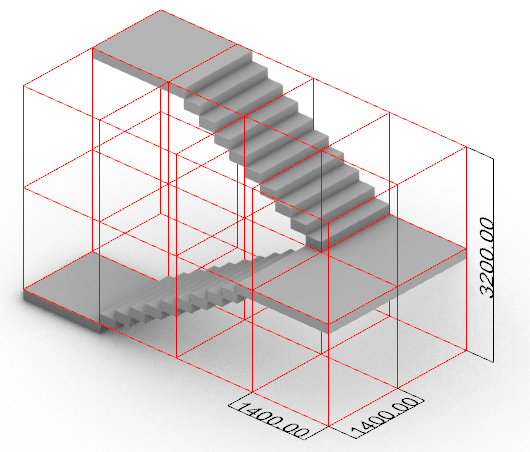

*Stair design*

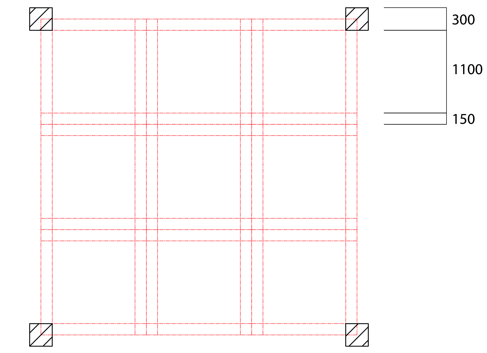

*grid*

By using this grid, a series of furniture tiles have been created. The inhabitant of the house will arrange these furniture tiles in a way that suits their needs. The tiles can be arranged however they like, but a walking space (in blue) has been defined to make their job a little easier. These walking spaces are spaces that are required for a space to function (outside of the grid) or are able to provide for other tiles (inside the grid)

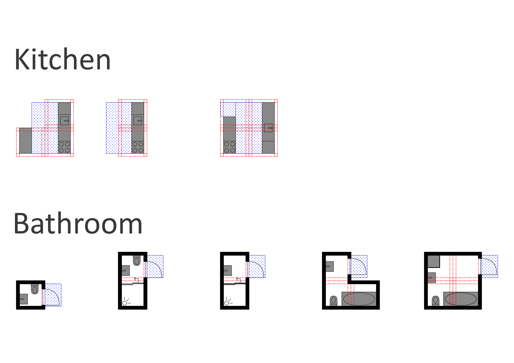
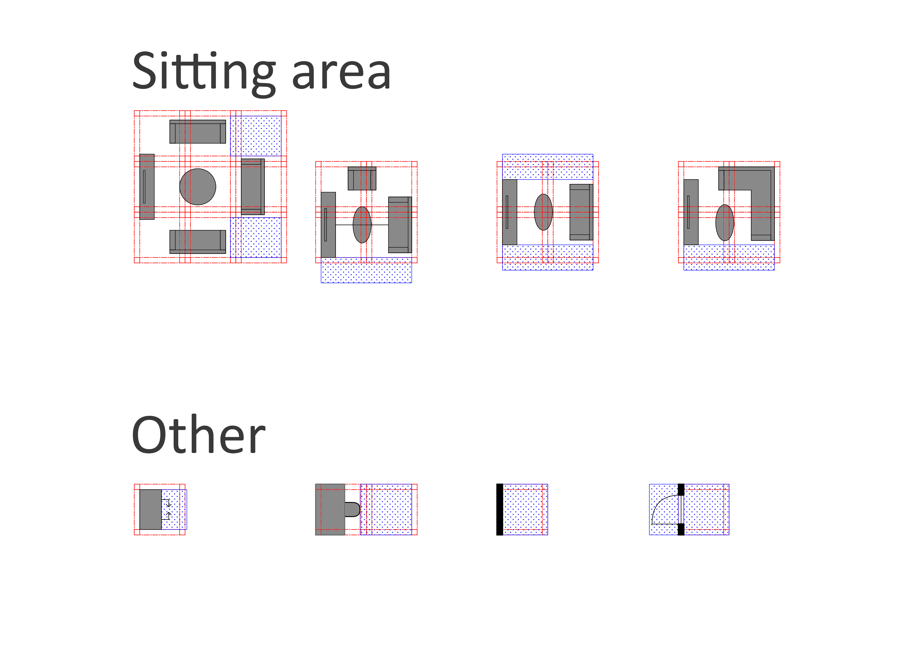
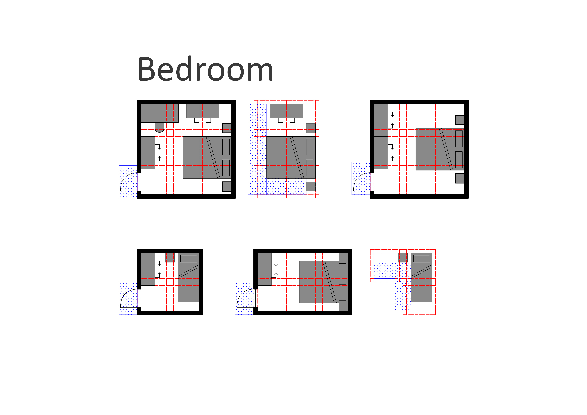

*tiles*

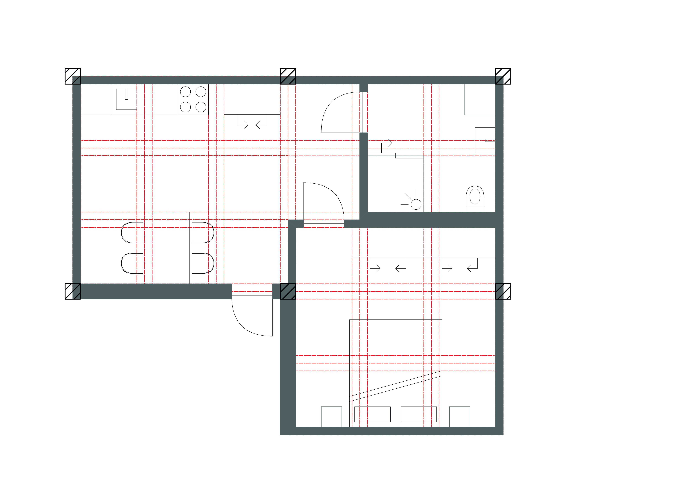

*Example of a house (assisted living)*

# Facade Forming Process

## Forming the first tileset

The goal of the architectural part of the project is to make the building look habitable and appealing while at the same time being modular and efficient. The key problem here is that the façade will easily look repetitive, therefore making it look less appealing.

The first challenge to overcome was to create façade tiles that are laid over the final mesh. These tiles have to fit to the mesh, making sure that there are no gaps or weird corners. In the picture below, you can see the first tile set. The set was inspired by the Casa Milà, a building by Antoni Gaudì. The reason why this inspiration is chosen, is Gaudì’s process of design is completely different to our process. Gaudì spent a lot of time on details, creating incredibly complex buildings where every corner is different. On the contrary, our façade is a series of equal elements. The main challenge here is to capture a similar, lively and expressive feel by using a completely different method.

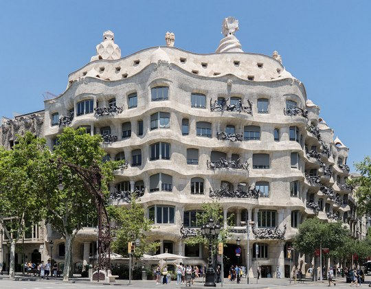

*Casa Milà - Antoni Gaudì*

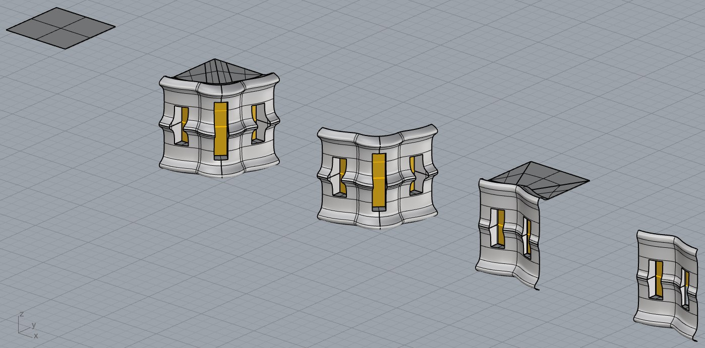

*first tileset*

## Forming the second tileset

To make the building look less repetitive, it is usefull to create multiple tilesets for different parts of the building. The following tilesets are inspired by "One River North", a building that was designed by MAD architects. This huilding has a very clear seperation between an organic part and a postmodernistic part. Inspired by this seperation, the following tilesets were created.

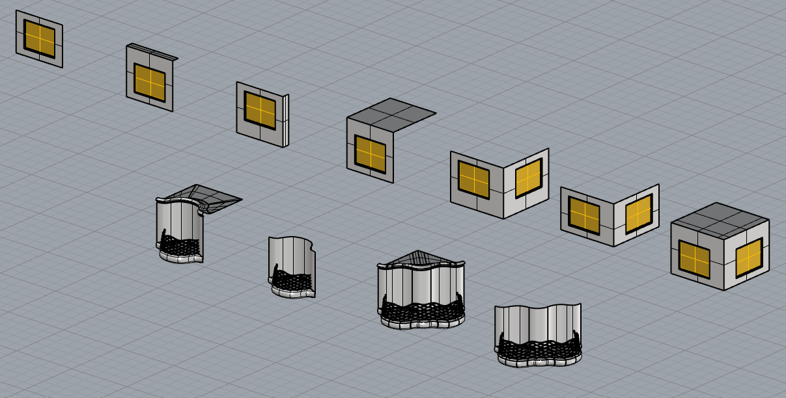

*Second and third tilesets*

The challenge with this idea is to select whether a voxel should be tiled by the second or the third tileset. One idea is to manually select voxels from the final mesh as either group 1 (tileset 2) or group 2 (tileset3). By using this method, the architect has a lot of control over the process, but it is not automatic.

A second idea is to give a tileset to a group of agents. This method gives less control to the architect, but makes the process automatic. For this to work, it is required that every agent is exported as a diffent meshes. The exported meshes that would get the same tileset would need to be grouped as one mesh. The main problem that this method creates is that the code must know that it is next to a voxel that belongs to a different group. This is required because tiles of different groups do not necessarily connect very well. In the images below two versions of the same part of the building are shown. In the first part, voxels recognize the neighbouring voxel (that belongs to a different group) as air. In the other version it recognizes the neighbouring voxel as a neighbouring voxel from a different group. In the example, this was done manually.

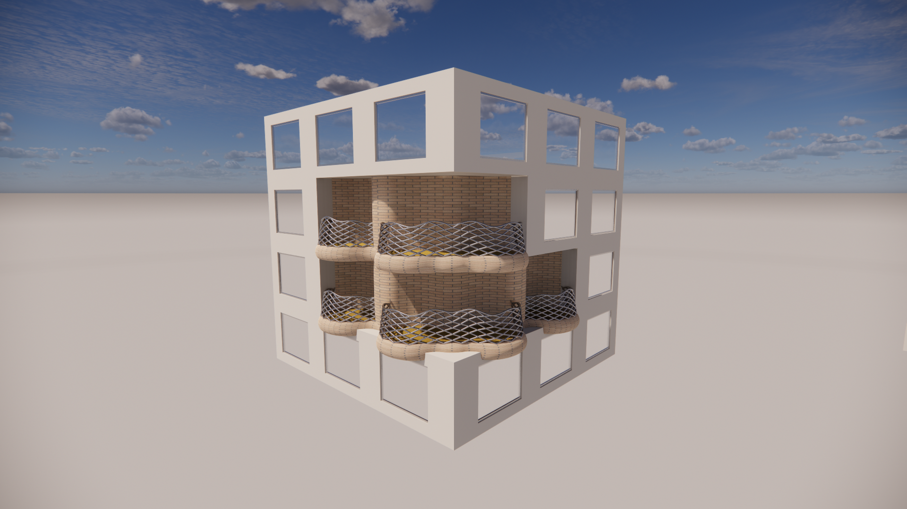

*Version 1 frontside*

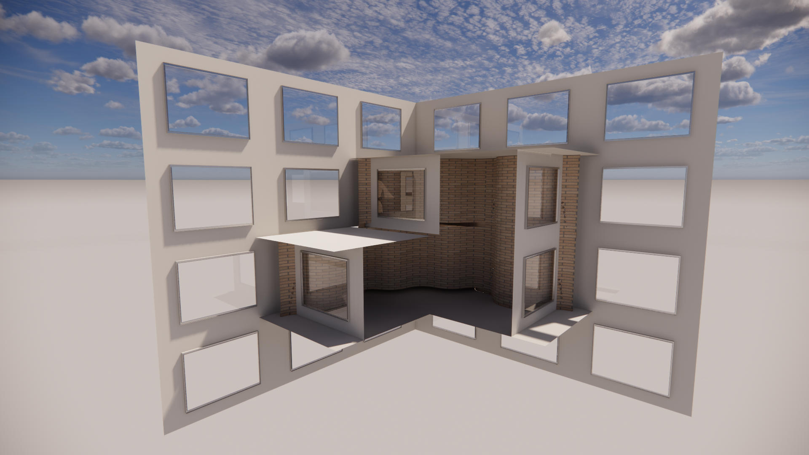

*Version 1 Backside*

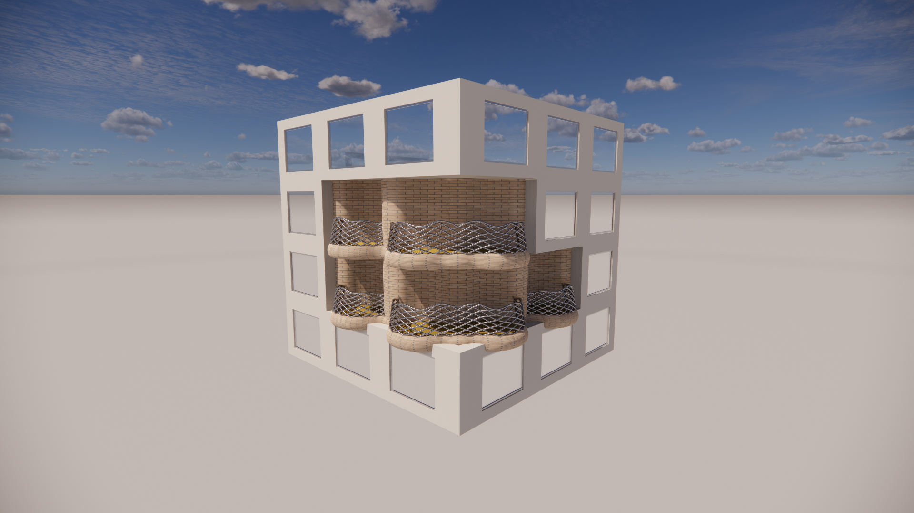

*Version 2 frontside*

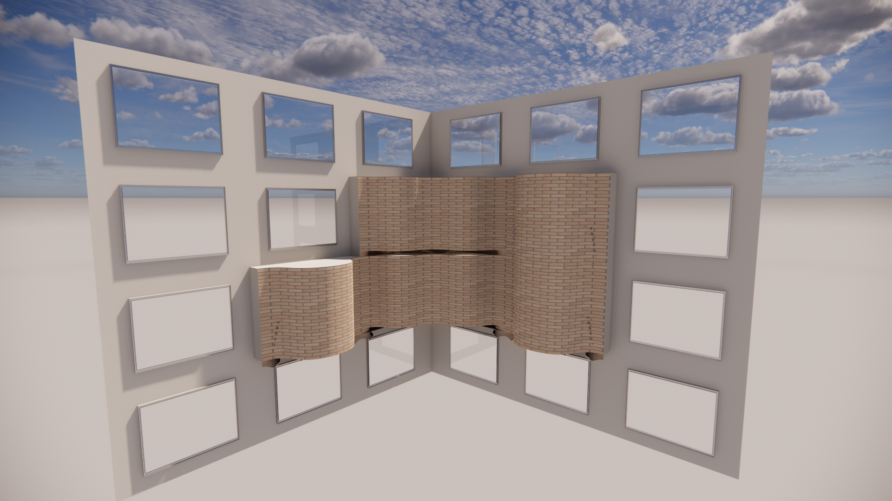

*Version 2 Backside*

With tileset 2 and 3, the frontside looks as it should look. on the contrary, the backside looks very strange. It would be very different if different tilesets are used. It would be a lot easier if there are only minor changes between the tilesets (only different windowsizes, for example.) It gets more complicated when a facade tile is further away from the border of the voxel.

For this project, this does not lead to any problems. However, for future projects this will most likely become an issue. Especially when the construction becomes part of the project, it is important that a solution is found.