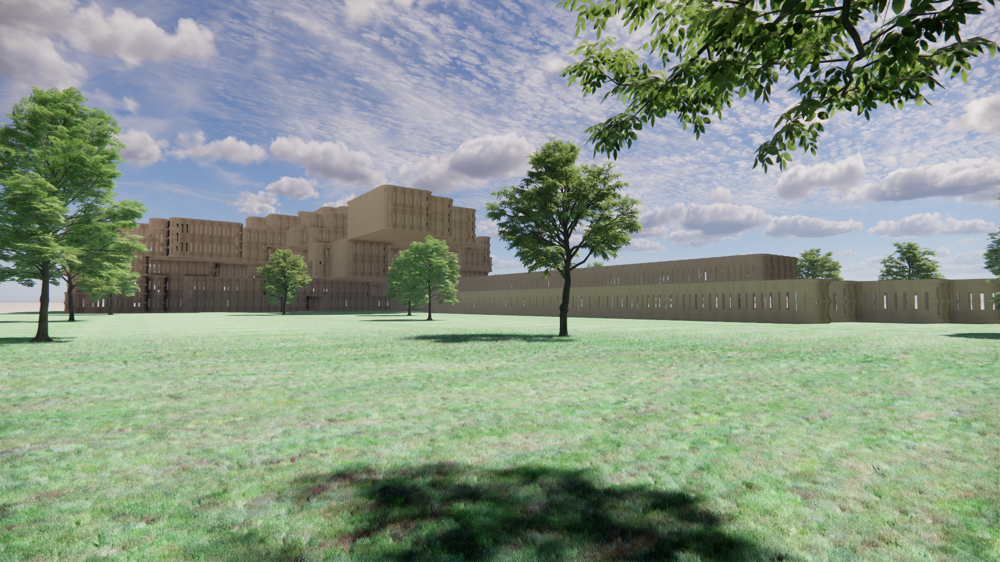
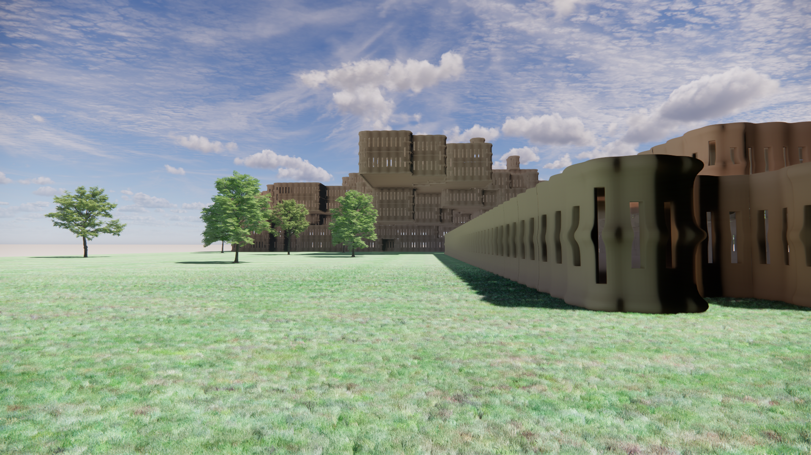
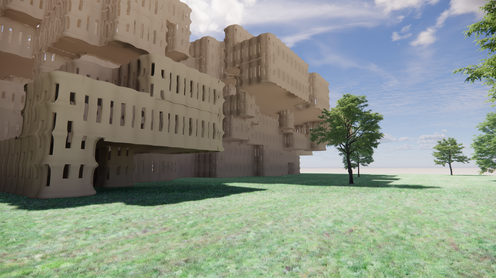
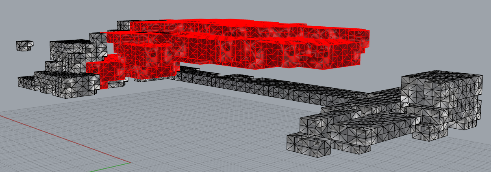
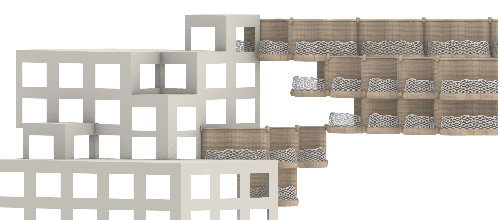

# Forming Product

## Forming the first model

The model is created by using the first tileset and the final mesh (all agents combined). The result looks like this:

## Forming the second model

For a new model, it would be interesting to use multiple tilesets for the same building. We have already created a seperate mesh per agent. We ran this for an updated script with an extra field. This leads to the building that is seen below. All living spaces have been colore red, all other spaces have been colored black.

By manually puting the tiles on this building, we get the following image. This is done manually because the new tilesets do not work in code (the balconies are turned upside down on all voxels on the ground floor). The problem probably lies in the used symetry stencil.

Visually, we prefer the first model. It looks a lot more clean. For future projects, the second version offers a lot more potential.