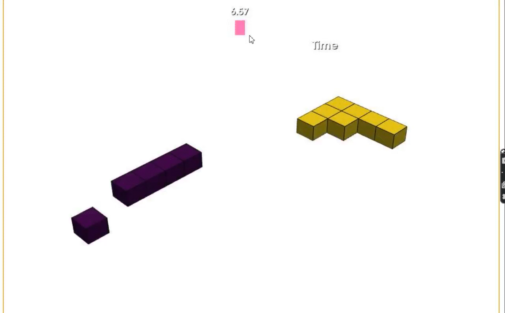
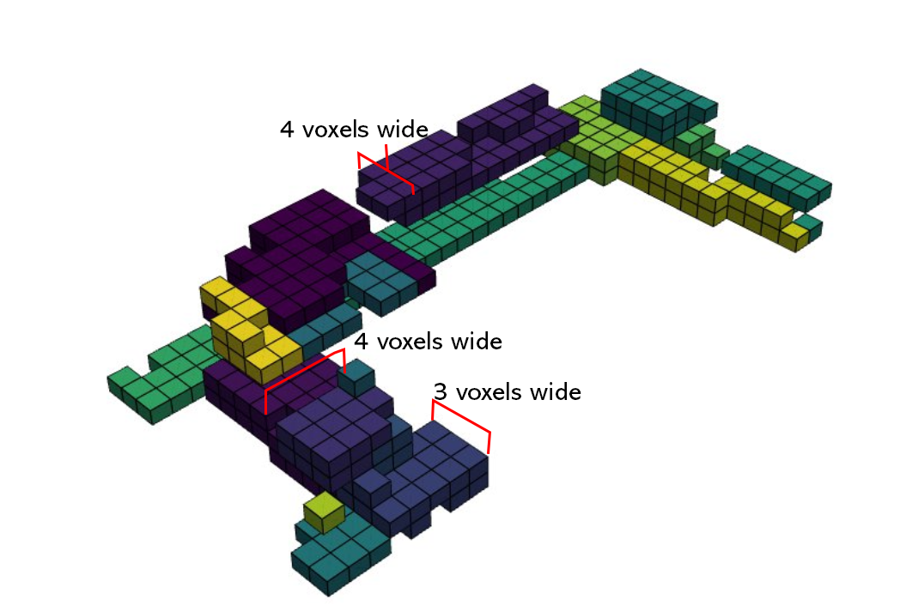
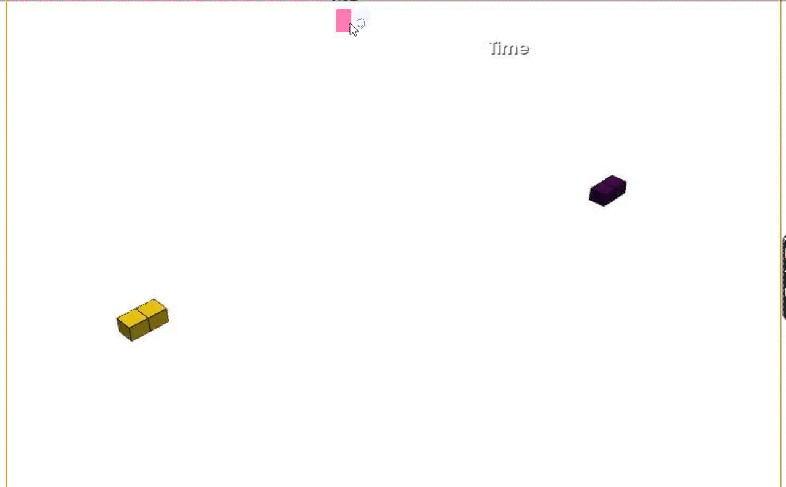

# Project reflection

this page is setup to reflect upon the process during the project, with possible improvements if we were to repeat the courze. the page starts with reflections upon what went really well and things we are proud of during the project process. the end of the page reflects upon the growth process of the minor throughout the years 

## We did really well on:   

Throughout the process we had clear design goals and we worked as a group towards those goals.
Every week we would meet multiple times for in person sessions in which the progress until then was discussed as well as any problems pertaining to the project.
Before the minor certain ambitions were laid out by each member and we think that most of those ambitions were met during the process.
We eventually came up with a project name that pertains really well to the architectural design and is a good play on words.
The analysis specifically the municipal plan of Rotterdam with the different types of cities (Compact, Healthy, Inclusive, Environmental and Productive) really went well with the design goals of the minor and certain personal goals. This eventually led to choice of agents and fields.
finally we think we did really well working together and Helping each other throughout the process.

## Analysis improvements

The project should have started with a better groupbound analysis process consisting of a location visit. because of time and covid restrictions this was not undertaken.
The flowchart was finetuned throughout the project however the final conclusion is that we should have started with two flowcharts one for a planning including intermediate milestones. The second flowchart would be more about dataflow and expected data types.
Throughout the entire process of documentation of our ideas was often lacking. In a follow up subject that should be improved upon.

## Agent improvements

We could have implemented a more challenging set of agents that lead to more separation in the building and would require more outside functionality. Examples of this would be:

    childcare
    educational facilities
    big supermarket
    Car mechanic

With the increase in building size discussed further in model improvements the space requirements per agent could have increased. For example more student and starter housing could have been implemented.

## Model improvements

In the future improvements to the model would include the full Implementation of street view and street distance adaptive fields. These were only tested but due to calculation time not fully implemented in the agent based model growth. As well as the following adaptive fields like:

    Facade connection
    Sun access
    Sky view factor
    Noise approval

Could be added in the future. We didn't experiment with any of the other envelope sizes it would have been intresting to make the building taller for example.

## Polygonization improvements

The main improvements towards polygonization that were not made due to time constraints were the creation of more tile sets per agent group or individual. In the final no doors or shopping windows are present thus giving the building a very generated feeling.

## Reflection agenth growth

It has come to our attention that not all our behaviors act consistently yet. 
First of all the Squareness behavior does work, in all test it has performed as expected, This will be visible in the below Gifs. 
Second is eating and abandoning voxels. This works as well to an extent, it seems to stop at a local maximum which is what is desired.
Third is agent connectiveness. This is the behavior that is most inconsistent. It sometimes works and it sometimes doesn’t.  We speculate that the weight connectiveness is being outweighed by other fields. Connectiveness is one of the most important behavior’s for creating a well made suited configuration and this fix should be of strong priority. 
And lastly building depth works as written. However it is not the end result we desire as it focuses on the depth of every agent and not the depth of the building as a whole. There are benefits if the current building depth and that is L shapes are allowed  and it doesn’t unnecessarily make for a porous result as in the other building depth that has been used and that can be found in Cub3d. Effort should be made to find a common ground between the building depth of Cub3d (and of 8-bit, an adjacent group work) and to attempt to implement our building depth but on the building level and not only agent level.

.png)

## Comparison

A partial goal of the minor is to improve upon previous versions. this is done through the exploration of personal intrests of group members.

There have been previous groups and projects that had buildingcode correct corridors throughout the building on each floor. They kept fire safety and ease of use more in mind. It is however unclear if the corridors were placed manualy. Implementing or looking into this would have led to a better building in our opinion.

Previous groups had their final building configuration better set up early on which led to the creation of more livly renderings with trees and people. This would have helped with the impressions a viewer of the site or project. the building could have also been fitted better with the imidiate surroundings.

Previous groups started with visualizing the concept behind every field in A3 this would have led to a better website.

